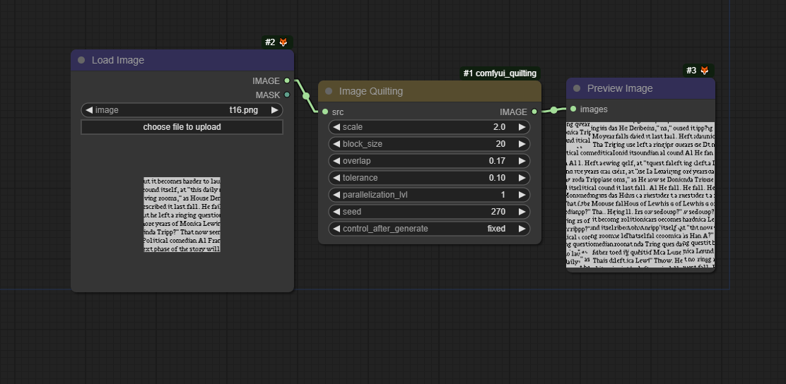
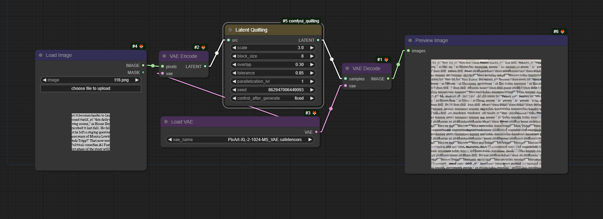

# comfyui_quilting
Image and latent quilting nodes for [ComfyUI](https://github.com/comfyanonymous/ComfyUI).

### Image quilting 

### Latent quilting

### Args

**scale** :
    The output will have the source dimensions scaled by this amount. 

**block_size** :
    The size of the blocks given in pixels for images.
    In latent space use the number of pixels divided by 8 instead.

**overlap** :
    Given as a percentage, indicates the portion of the block that overlaps with the next block when stitching.

**tolerance** :
    When stitching, tolerance defines the margin of acceptable patches. 
    Lower tolerance selects sets of patches that better fit their neighborhood but may result in too much repetition.
    Higher tolerance avoids repetition but may generate some not-so-seamless transitions between the patches.
    A tolerance of 1 means that patches with an error value lower than **2** times the minimum error, of the more "seamless" patch, can be selected instead (the selection is random).

**parallelization_lvl** :
* 0 : Runs the algorithm sequentially.
* 1 : Segment the generation into 4 quadrants, which are generated in parallel. 
* 2 or more: this is not recommended in most use cases, and can be slower than using the previous parallelization lvl. Consider it for bigger generations, patches and also mind the available cpu cores.
Each quadrant's process will use a number of subprocesses equal to the parallelization lvl to generate that quadrant. The generation is done via cascading rows, where a row can only be generated to the same extent as the previous row.

**Changing the parallelization level will affect the output!**

The sides where the overlap occurs differ for each quadrant, 
so it is not possible to reproduce the same result as the sequential algorithm.

Higher levels of parallelization do not suffer from this problem conceptually, 
however the current implementation won't generate the same output.

